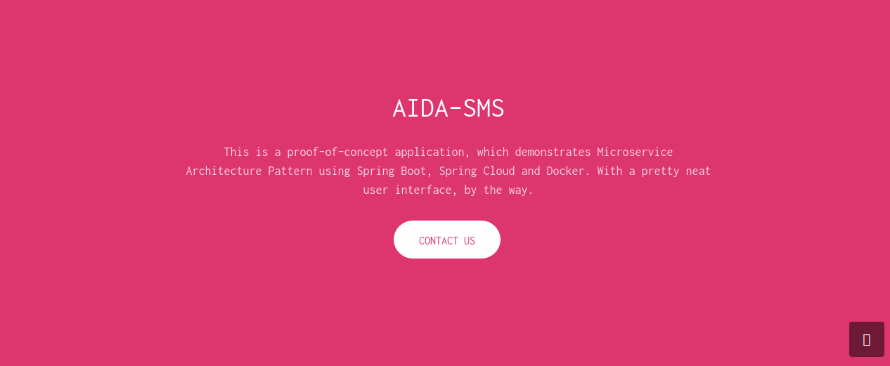

SMS
==============

一个简单的网店管理系统。

这是一个用于展示微服务的 proof-of-concept 应用，运用了Spring Boot, Spring Cloud 以及 Docker部署。

## 核心服务

SHOP 分成了三个核心微服务，它们都是独立开发的，采用了Spring MVC架构：

Order service

进行订单的添加，删除，以及显示

| Method | Path  | Description  | User authenticated | Available from UI |
| :----: | :---: | :----------: | :----------------: | :---------------: |
|  GET   |   /   |    返回订单列表    |         无          |         有         |
|  GET   | /form | 增加订单，并进行用户选择 |         无          |         有         |
|  POST  | /line |  增加一条订单到数据库  |         无          |         无         |
|  GET   | /{id} |  显示某一条订单的详情  |         无          |         有         |
|  POST  |   /   |    增加订单行为    |         无          |         有         |
| DELETE | /{id} |     删除订单     |         无          |         有         |

Customer service

进行用户的添加，删除，以及显示

| Method | Path  | Description | User authenticated | Available from UI |
| :----: | :---: | :---------: | :----------------: | :---------------: |
|  GET   | /list |   返回用户列表    |         无          |         有         |
|  GET   | /{id} | 返回指定id的用户详情 |         无          |         有         |
|  GET   | /form |  返回增加用户界面   |         无          |         有         |
|  POST  | /form |    增加用户     |         无          |         无         |
|  PUT   | /{id} |   增加用户行为    |         无          |         有         |
| DELETE | /{id} |    删除用户     |         无          |         有         |

Catalog service

进行商品的添加，删除，以及显示

|     Method      |     Path      | Description | User authenticated | Available from UI |
| :-------------: | :-----------: | :---------: | :----------------: | :---------------: |
|       GET       |     /list     |   返回商品列表    |         无          |         有         |
|       GET       |     /{id}     | 返回指定id的商品详情 |         无          |         有         |
|       GET       |     /form     |  返回增加商品界面   |         无          |         有         |
|      POST       |     /form     |    增加商品     |         无          |         无         |
|       PUT       |     /{id}     |   增加商品行为    |         无          |         有         |
|     DELETE      |     /{id}     |    删除商品     |         无          |         有         |
| TEXT_HTML_VALUE |  /searchForm  |   返回搜索界面    |         无          |         有         |
| TEXT_HTML_VALUE | /searchByName |   返回搜索结果    |         无          |         有         |

注意

- 每个微服务都有自己的数据库，因此互相之间没有直接访问数据库的接口
- 这里的数据库使用的是spring框架自带的数据库
- 服务到服务的通信非常简单，通过暴露的接口即可

## 架构服务

分布式系统中有一些通用的模式，Spring Cloud框架都有提供，在本项目中仅仅运用了一小部分：

### API 网关

可以看到，有三个核心服务，它将外部API暴露给客户端。在一个现实世界的系统中，核心服务的数量可以非常快速地增长，并且整个系统的复杂性更是急剧增加。实际上，一个复杂的网页可能需要渲染数百个服务。

理论上，客户端可以直接向每个微服务器发出请求。但是显然，这将面临很大的挑战以及限制。比如必须要知道所有端点的地址。

通常一个更好的方法是使用API网关。它是系统中的单个入口点，用于通过将请求路由到适当的后端服务或通过调用多个后端服务并聚合结果来处理请求。此外，它还可以用于认证，压力测试，服务迁移，静态响应处理，主动流量管理等

Netflix开辟了这样一个优势服务，现在使用Spring Cloud，我们可以通过一个@EnableZuulProxy注释来实现。在这个项目中使用了Zuul存储静态内容（ui应用程序），并将请求路由到适当的微服务器。

Zuul使用服务发现机制来定位服务实例以及断路器和负载平衡器，如下所述。

### 服务发现

另外一个众所周知的架构模式便是服务发现机制。它可以进行服务实例网络位置的动态检测。当应用需要扩展、容错或者升级的时候就可以自动为服务实例分配地址。

服务发现机制的核心是注册阶段。本项目使用了 Netflix Eureka。 Eureka是一个客户端的发现模式，因为很多网络应用都需要客户端自己去确定特定服务的地址（使用注册服务器）并且进行请求的负载均衡。

使用Spring Boot时，只要在pom文件中加入spring-cloud-starter-eureka-server依赖并且使用@EnableEurekaServer注解即可使用该服务。

### 负载均衡、断路器以及Http客户端

Netflix还提供了另外一些十分好用的工具。

#### Ribbon

Ribbon 是一个客户端的负载均衡器。相比传统的均衡器，你可以之间链接到相关服务。Ribbon已经和Spring Cloud以及服务发现机制集成在了一起。 Eureka Client 提供了一个可用服务器的动态列表供 Ribbon 进行服务器之间的均衡。

#### Hystrix

Hystrix 是断路器模式的具体实现，其可以调节网络访问依赖中经常出现的延迟以及错误。其主要目的是为了阻断在分布式环境中大量微服务极易出现的级联错误，使得系统尽快重新上线。Hystrix还提供了一个监控页面 （下面将会看到）。

## 运行

前期准备：

- 网络

- 安装 Docker 以及 Docker compose

运行命令：

- `cd microservice-demo/`执行`mvn clean package`
- `cd ../docker/`执行`docker-compose build`以及`docker-compose up`

重要端口：

- http://127.0.0.1:8080 - 网关
- http://127.0.0.1:8761 - Eureka Dashboard

注意：

**应用启动之后如果遇到 Whitelabel Error Page 错误请刷新页面**

## UI

**Index**

**Customer Service**

**Catalog Service**

**Order Service**

**Eukera Service**

**Hystrix Dashboard**

